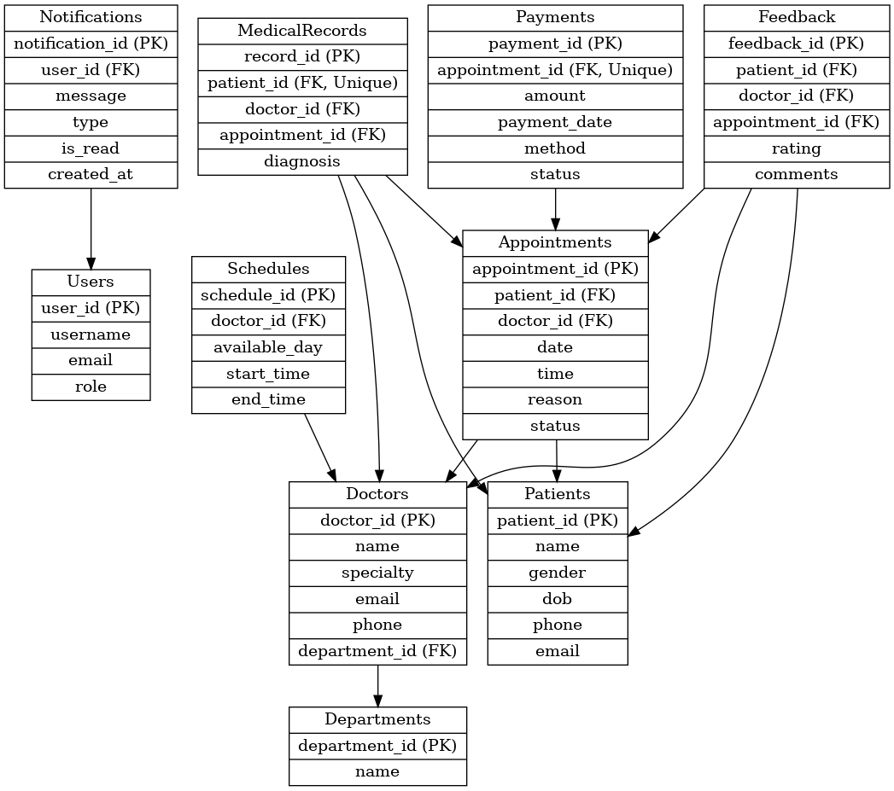

# Clinic-Booking-System

Week 8 Database Management System
# 🏥 Clinic Booking System (MySQL-Based)

## 📌 Overview

The **Clinic Booking System** is a relational database project designed using **MySQL** to efficiently manage clinic operations including patient records, appointments, doctor schedules, payments, and feedback. The goal is to simulate a real-world clinic environment with normalized tables and properly enforced relationships.

---

## ⚙️ Features

- ✅ Patient registration and profile management  
- ✅ Doctor profiles and department allocation  
- ✅ Appointment scheduling with status tracking  
- ✅ Doctor availability and working schedule  
- ✅ Payment recording with multiple payment methods  
- ✅ Medical records including diagnosis, treatment, and prescription  
- ✅ Patient feedback and rating system  
- ✅ User notifications  
- ✅ Role-based user management (Admin, Doctor, Patient)

---

## 🧱 Database Schema

The system uses the following main tables:

- Users
- Patients
- Doctors
- Departments
- Appointments
- Schedules
- Payments
- MedicalRecords
- Feedback
- Notifications

Relational constraints such as PRIMARY KEY, FOREIGN KEY, UNIQUE, and ENUM are used to ensure data integrity.

## 🗂️ Project Structure

## 🧪 How to Use

1. **Clone or download** this repository.
2. Open **MySQL Workbench** or your preferred SQL client.
3. Run `schema.sql` to create the database schema.
4. Run `sample_data.sql` to populate the tables.
5. Use SQL queries or a custom frontend to interact with the system.

## 🧭 Entity Relationship Diagram (ERD)

A full version is also included in editable `.drawio` format for custom modifications.

---

## 📌 Notes

- All appointment-related tables (Payments, Feedback, MedicalRecords) depend on Appointments table.
- Schedules manage doctor availability for booking logic.
- Users can have roles to support frontend integration for access control.
- Notifications are linked to user activities and statuses.

## 🤝 
## 🧑‍💻 Author

**Victoria Mwende**  
GitHub: [@VictoriaVquay](https://github.com/VictoriaVquay)

---

